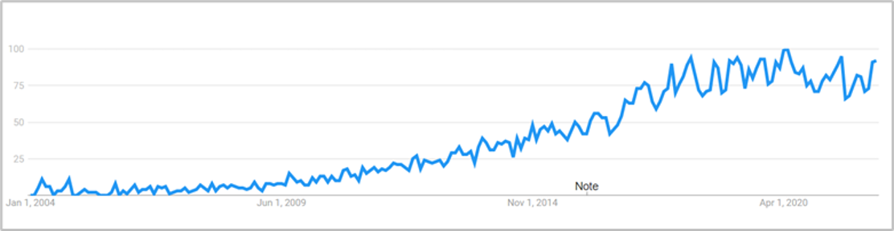

## Introduction to Sentiment Analysis

#### Definitions

> “Sentiment analysis, also called opinion mining, is a field of study that **analyses people’s opinions**, sentiments, appraisals, attitudes and emotions **towards entities and their attributes** expressed in written text” [1]

> “Sentiment analysis, also called Opinion Mining, is the task of extracting and analysing people’s opinions, sentiments, attitudes, perceptions, etc., toward different entities such as topics, products, and services.” [2]

Sentiment analysis (SA) is **a classification problem**[2] that aims to generate sentiment labels (positive, neutral, negative) for a given input dataset. For the most part, sentiment analysis is recognised as a **sub-discipline of both NLP** (natural language processing) and semantic analysis, but it is also referenced under the fields of data mining, web mining, information retrieval, and machine learning[1][6]. Although SA is a sub-discipline of NLP, it encompasses many individual NLP subtasks such as sarcasm and subjectivity detection[2].

#### Use over time

Natural language processing began in the 1950s, however sentiment analysis only became a branch of interest around 2005 (Yue et al., 2018). Predecessors to SA were common throughout the 1990s, … Since the 2000s, the explosive growth in digital and social media has led to a boom in digital records.. In recent years, researchers have also begun exploring methods for multi-modal SA, i.e. the use of images, videos and audio formats as well as text[1][6]. Since 2004, there has been growing interest in this research area[2].

#### Differentiating between Emotion and Sentiment

Yue et al., (2019) point out that the terms "emotion" and "sentiment" are often used interchangeably, whereas the field of psychology draw a clear line between the two. For the field of sentiment analysis, a prerequisite for any successful analysis is to clearly define the outcome and element of interest, i.e. emotions or sentiments.

Emotions are consistent of a subjective experience, a physical response, and a behavioural response. Sentiments are merely a mental attitude, often based on emotions. As such, sentiments are mechanisms for conveying thoughts of an individual based on their emotion[21].

From a psychological point of view, emotion and sentiment are two different concepts. As for emotions, Watson and Tellegen's well-known model forms a two-dimensional structure of emotions (figure below), while psychologist Paul Eckman and others proposed sets of basic emotions.

List of Basic Emotions (click to expand)

| Basic Emotions |
|----------------|
| Happiness |
| Sadness |
| Anger |
| Fear |
| Surprise |
| Disgust |
| **More Emotions added later** |
| Pride |
| Excitement |
| Embarrassment |
| Contempt |
| Shame |

The two-dimensional structrue of emotions (click to expand)

Sentiment on the other hand, refers to a mental attitude based on emotion. It follows that sentiment is used to convey the thoughts of the individual deriving from his/her emotion. Sentiment thereby is not confined to psychological dimensions, but is "highly organised". 

 

#### Opinion vs. Sentiment

Similar to the blurred lines between sentiment and emotions, there is also a need to clearly lay out the differences between opinions and sentiments. An opinion is a view, judgement or appraisal formed in the mind about a particular matter and it represents a person’s concrete view about something. Sentiment, on the other hand, marks an attitude, judgement or thought prompted by feeling. As such, a sentiment may be caused by an opinion. Opinions are underlying and broader concepts compared to sentiments. For example, we can have opinions beyond just positive and negative that are not sentiment-related at all[1].

As a foundation for any research on sentiments, there is a need for a clear definition of opinions, sentiments and how the two are connected. Liu proposes the following definitions:

 

> **Opinion** = (e, a, s, h, t), where e is the target entity, a is an aspect of the entity, s is the associated sentiment, h is the opinion holder, and t refers to the time.
> 
> **Sentiment** = (y, o, i), where y is the type of sentiment (domain dependent), o marks the orientation or valence (positive, negative, neutral), and i is the intensity of sentiment (represented in numerical terms).

Building on this framework, several application fields for SA additionally require information on the **geolocation** of the opinion holder[6]. This is particularly true for the monitoring of socio-political events such as protests or election outcomes[6]. An **extended six-tuple (e, a, s, h, t, p)** is suggested in those cases, where p marks the place of the opinion.

#### Types of Sentiment Analysis

Sentiment analysis is usually categorised by the level of analysis: document, sentence, and aspect-level.

<!--  -->

**Document Level**: The aim at this level is to classify a whole opinion document, e.g. a product review, into a positive, negative, or neutral sentiment. This level of analysis makes the bold assumption that the entire document is concerned with a single entity.

**Sentence Level**: Similar to the document level, the aim is to determine whether a given sentence has a positive, negative or neutral sentiment.

**Aspect Level**: This is a more fine-grained level of analysis in which a sentiment classification is performed along with an extraction of the target of the opinion. In other words: “aspect-level analysis directly looks at an opinion and its target”[1]. The target can refer either to an entity (e.g. a camera) or any of an entity’s aspects (e.g. camera’s shutter speed). Most of today’s applications for sentiment analysis require an aspect-based analysis. An even more fine-grained analysis would include the identification of the reason for the opinion (e.g. “because I am small”) and a qualifier that indicates the limits to which the opinion applies (e.g. .

#### Challenges in Sentiment Analysis

**Sarcasm**: The act of writing something positive but meaning it negative or vice versa. The complexity and ambiguity make it very challenging to identify. There have been some approaches for sarcasm detection in bidirectional LSTM with SoftMax attention layer and CNN[1][2].

**Negation handling**: Sometimes negation words are removed during pre-processing since they appear in the stop-words list, or they are ignored in the sentiment scoring process since they have a neutral sentiment value. Handling negation is not simply solved by reversing the polarity because sometimes they appear in sentences without influencing sentiment[2].

**Word sense disambiguation (WSD)**: Words can have different meanings in different contexts[2][1]. Also, opinion words can be used in contexts that don’t actually have a sentiment[1]. Spam, fake reviews[2] or fake or deceptive opinions[1].

**Ignorance of pronouns**: Pronouns are often excluded from the sentiment classification, but can offer critical hints about the relation of the entity in question[2]. Limited resource languages: Languages without large datasets … [2]

**Mixed Languages**: SA of code-mixed data, especially in multilingual societies, sentences can contain vocabulary of several languages that make analysis extremely difficult[2].

**Absence of sentiment words**: Many sentences that do have a sentiment don’t actually contain sentiment or opinion words. The sentiment is implied[1]. Multimodal analysis: Current research is addressing the issue of how to integrate multimodal data formats in sentiment analysis[6].

**Socio-Political Analyses**: SA for product reviews is fairly “easy” to implement due to direct manner of opinion formulation, however, socio-political opinions are far more complex to analyse as they require background knowledge[1].

#### Generic Sentiment Analysis Process

The generic process of SA encompasses the broad steps of data acquisition, data pre-processing, sentiment classification, output and presentation[2]. The data pre-processing involves several sub-steps: tokenization, stop word removal, part of speech tagging, and lemmatization[2].

<!--
Feature extraction, meaning to extract valuable information that helps express sentiment. Punctuations\[2], emoticons[2], hashtags[2], capitalisation[2], TF-IDF[2][8], PoS tagging[2], Opinion words and phrases[2], Negations[2], Bag of words[11], word-level and character-level n-grams[11]

For deep learning, word embedding: Word2vec: consists of SkipGram and continuous bag of words CBOW. The skip-grams predict the words that are likely to surround a given token, whereas CBOW does the opposite as it predicts the word that is likely to occur given a certain context[9].

We can differentiate between several methodological approaches to SA. \[2\] Unsupervised Partitional algorithm – decomposes data into a set of disjoint clusters – k means Hierarchical algorithm Semi-Supervised Graph-Based approach, \[2\]\[6\] TwEmLab \[19\] → 3D similarity computation for graph edges between nodes -> Modified Adsorption MAD; Wrapper approach[6] Generative Approach.. [2], Topic-based approach (LDA)[6] Multi-View Learning approach,[2] Supervised Rule-based, IF-THEN \[2\]\[6\] Common rule-based techniques TF-IDF \[7\] VADER \[18\] - VADER is a lexicon and rule-based sentiment analysis tool that is specifically attuned to the sentiments expressed in social media. linear approaches (SVM, ANN) \[2\]\[6\] probabilistic (NB, Max Entropy) \[2\] deep learning (DNN, CNN, RNN, other) \[2\]\[6\] and Transformers \[3\]
-->

 

### SA Methods Overview

A vast range of methods have been used for sentiment analysis. A **general overview** is provided by Birjali et. al (2021):

With a stronger focus on **deep and machine learning methods**, Yadav and Vishwakarma (2020) provide a more focussed overview: 

 

References (click to expand)

\[1\] Liu, B. (2020). Sentiment analysis: Mining opinions, sentiments, and emotions. Cambridge university press.

\[2\] Birjali, M., Kasri, M., & Beni-Hssane, A. (2021). A comprehensive survey on sentiment analysis: Approaches, challenges and trends. Knowledge-Based Systems, 226, 107134.

\[3\] Vaswani, A., Shazeer, N., Parmar, N., Uszkoreit, J., Jones, L., Gomez, A. N., ... & Polosukhin, I. (2017). Attention is all you need. Advances in neural information processing systems, 30.

\[4\] Peteres, M.E., Neumann, M., Lyyer, M., Gardner, M., Clark, C., Lee, K., Zettlemoyer, L., (2018). Deep Contextualized Word Representations.

\[5\] Devlin, J., Chang, M. W., Lee, K., & Toutanova, K. (2018). Bert: Pre-training of deep bidirectional transformers for language understanding. arXiv preprint arXiv:1810.04805.

\[6\] Yue, L., Chen, W., Li, X., Zuo, W., & Yin, M. (2019). A survey of sentiment analysis in social media. Knowledge and Information Systems, 60(2), 617-663.

\[7\] Drus, Z., & Khalid, H. (2019). Sentiment analysis in social media and its application: Systematic literature review. Procedia Computer Science, 161, 707-714.

\[8\] Haddi, E., Liu, X., & Shi, Y. (2013). The role of text pre-processing in sentiment analysis. Procedia computer science, 17, 26-32.

\[9\] Dang, N. C., Moreno-García, M. N., & De la Prieta, F. (2020). Sentiment analysis based on deep learning: A comparative study. Electronics, 9(3), 483.

\[11\] Mozafari, M., Farahbakhsh, R., & Crespi, N. (2019, December). A BERT-based transfer learning approach for hate speech detection in online social media. In International Conference on Complex Networks and Their Applications (pp. 928-940). Springer, Cham.

\[13\] Sun, C., Huang, L., & Qiu, X. (2019). Utilizing BERT for aspect-based sentiment analysis via constructing auxiliary sentence. arXiv preprint arXiv:1903.09588.

\[18\] Elbagir, S., & Yang, J. (2019, March). Twitter sentiment analysis using natural language toolkit and VADER sentiment. In Proceedings of the international multiconference of engineers and computer scientists (Vol. 122, p. 16).

\[19\] Resch, B., Summa, A., Zeile, P., & Strube, M. (2016). Citizen-centric urban planning through extracting emotion information from twitter in an interdisciplinary space-time-linguistics algorithm. Urban Planning, 1(2), 114-127.

\[20\] Veličković, P., Cucurull, G., Casanova, A., Romero, A., Lio, P., & Bengio, Y. (2017). Graph attention networks. arXiv preprint arXiv:1710.10903.

[21] Yue, L., Chen, W., Li, X., Zuo, W. and Yin, M., 2019. A survey of sentiment analysis in social media. Knowledge and Information Systems, 60(2), pp.617-663.

 

